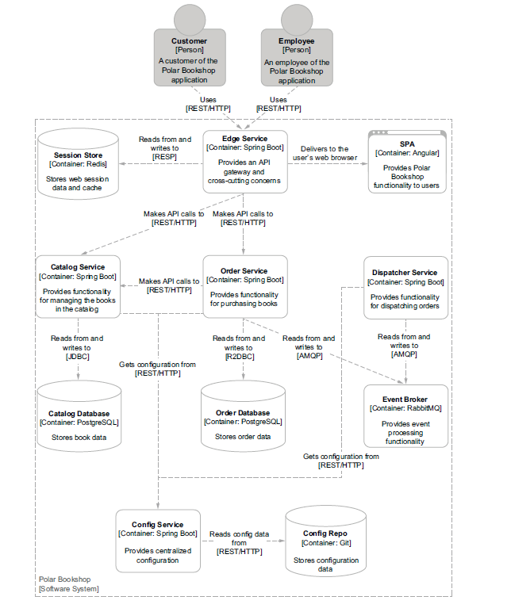

# Polar Bookshop

This repo follows Cloud Native Spring in Action.

Some great softwares used in this project:
- Spring Data(To establish a connection between Postgres and Rest API)

- Spring Reactive Web (To make a reactive non-blocking API)

- Spring Configuration Cloud (To provide configuration files for services)

- Redis to store Web Session data

- RABBITMQ (Provides processing functionality to the services more event-driven)

- Kubernetes (As containers orchestrator)

    I deployed the microservices in Amazon Elastic Kubernetes Service 

